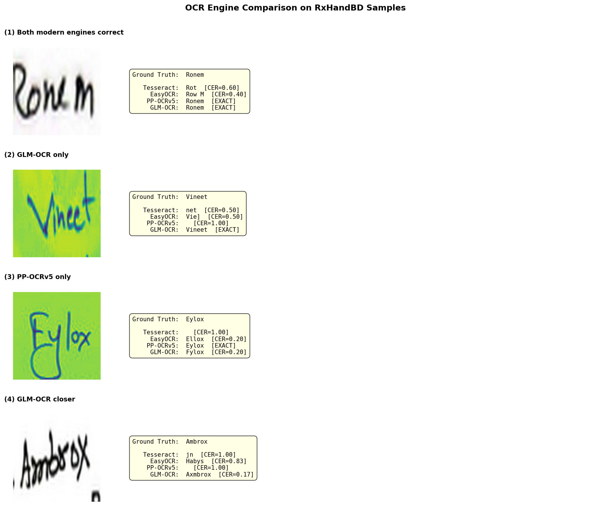
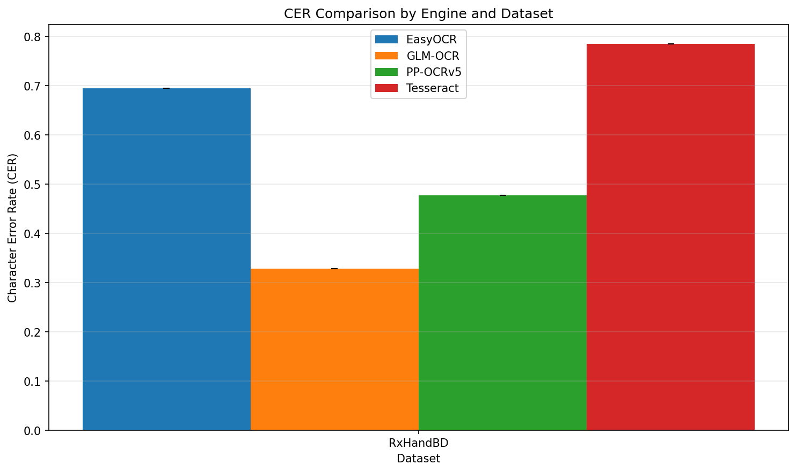
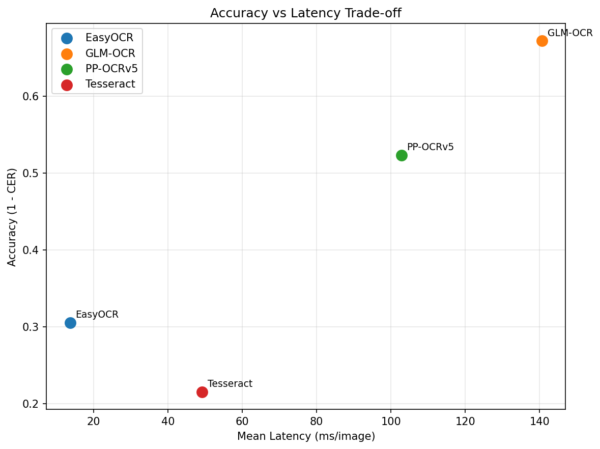
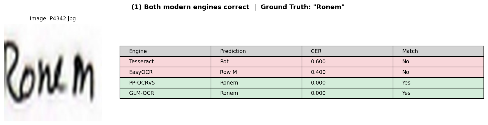
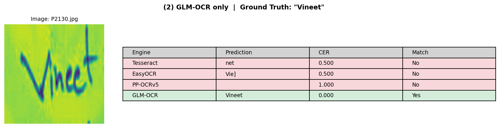
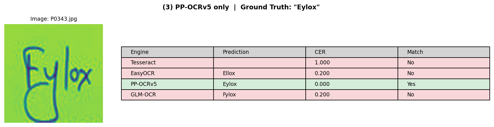
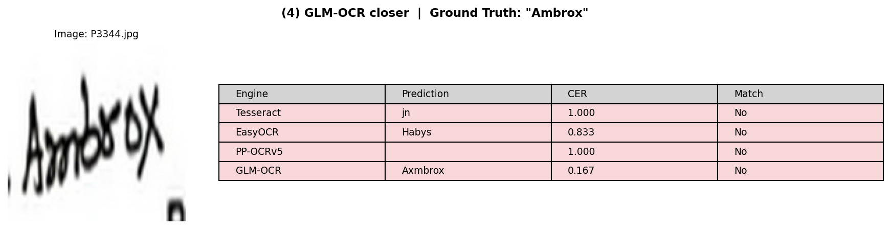
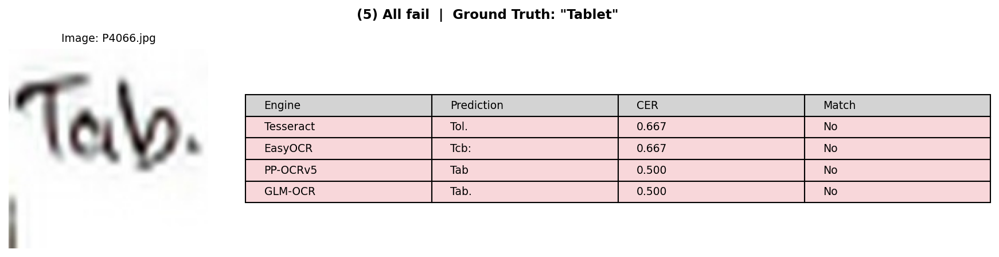

# 5 Million Parameters vs 900 Million: Who Reads Your Doctor's Handwriting Better?

*Benchmarking four open-source OCR engines on 5,578 handwritten medical prescriptions*

---

You've been there. You pick up a prescription from your doctor, stare at it, and wonder: is this *Amoxicillin* or *Amitriptyline*? If you, a literate adult, can't decipher it — can a machine?

This isn't just an academic question. According to the World Health Organization, medication errors injure approximately **1.3 million people annually in the United States alone**, and cost an estimated **$42 billion globally each year** [1]. Illegible handwriting is a well-documented contributor: studies have found that **35.7% of handwritten prescriptions contain errors**, compared to just 2.5% of electronic ones [2], and nearly **one in five prescriptions for high-alert medications** are hardly legible or outright illegible [3].

The open-source OCR landscape has evolved rapidly. PaddleOCR (73K+ GitHub stars) recently overtook Tesseract as the most-starred OCR project on GitHub, while GLM-OCR from Zhipu AI and Tsinghua University has emerged as a formidable competitor — a compact 0.9-billion-parameter vision-language model specifically designed for document understanding. Yet neither engine has been publicly evaluated on handwritten medical text.

This blog changes that. I benchmarked four open-source OCR engines on **5,578 handwritten prescription word images** and the results surprised me.

---

## Meet the Contenders

These four engines span three generations of OCR thinking — from traditional pattern matching to specialized deep learning to generative vision-language models. Here's who's competing:

### Tesseract — The Veteran

Google-backed and over 18 years old, Tesseract is the default OCR engine for a generation of developers. Under the hood, it uses an LSTM-based architecture that was primarily designed for printed text. It's robust, well-documented, and runs everywhere — but handwritten cursive is not its forte.

### EasyOCR — The Accessible One

Built on a CRNN (Convolutional Recurrent Neural Network) architecture with roughly **10 million parameters**, EasyOCR's selling point is simplicity: `pip install easyocr` and you're recognizing text in 80+ languages. It uses deep learning but remains a traditional detection-recognition pipeline.

### PP-OCRv5 — The Data-Centric Specialist

Baidu's latest, with just **5 million parameters**. PP-OCRv5 uses an SVTR_LCNet architecture with a Guided Training of CTC (GTC) strategy. But the real innovation isn't the architecture — it's the training data. The PP-OCRv5 paper [4] demonstrates that *data quality trumps model scale*: they curated **22.6 million training samples** using a systematic approach that analyzes data along three dimensions — difficulty, accuracy, and diversity. They found a "sweet spot" at the [0.95, 0.97] model confidence range where training samples are challenging enough to provide useful learning signal, yet reliably labeled. This data-centric philosophy yielded 2-3x improvements in handwritten recognition from v3 to v5 — without changing the model architecture.

### GLM-OCR — The Compact Vision-Language Model

From Zhipu AI and Tsinghua University, GLM-OCR takes a fundamentally different approach. It's a **0.9-billion-parameter** multimodal model combining a 0.4B CogViT vision encoder with a 0.5B GLM language decoder [5]. Rather than traditional CTC or attention-based sequence recognition, it *generates* text autoregressively — like a language model that reads images.

An important note: 0.9B is **compact** for a vision-language model. For comparison, Qwen3-VL has 235 billion parameters and GPT-4o is even larger. GLM-OCR was explicitly designed for efficiency, using Multi-Token Prediction (MTP) to generate approximately 5.2 tokens per decoding step — yielding a ~50% throughput improvement over standard autoregressive generation. It's trained through a sophisticated 4-stage pipeline that includes supervised fine-tuning and GRPO reinforcement learning.

These four engines represent a clear spectrum: **traditional** (Tesseract) → **specialized deep learning** (EasyOCR, PP-OCRv5) → **generative VLM** (GLM-OCR). The question isn't just "which is best?" — it's *does paradigm matter more than scale?*

---

## The Dataset: RxHandBD

We use **RxHandBD** [6], a dataset of 5,578 cropped word images extracted from handwritten medical prescriptions written by doctors in Bangladesh. Each image contains a single word with a corresponding ground-truth label.

Why is this dataset hard?

- **Doctor's handwriting.** Enough said.
- **Medical terminology.** Drug names like "Amoxicillin" and "Metformin" alongside dosage notations like "5% dns" and "1+0+1."
- **Mixed language.** English medical terms interspersed with Bangla script.
- **Inconsistent quality.** Varying paper backgrounds, pen types, and image capture conditions.

Here are a few samples to give you a sense of the difficulty range:

*From top to bottom: a drug name both modern engines nail ("Ronem"), cases where only one engine succeeds, and a nearly illegible "Capsule" that stumps all four.*

One important methodological note: these are **pre-cropped word-level images**. We're testing each engine's **recognition** capability directly — not its ability to detect text regions on a full page. This gives us a fair apples-to-apples comparison of the core OCR skill.

---

## Methodology

### Metrics

We evaluate using four complementary metrics:

- **CER (Character Error Rate):** The edit distance between the predicted and reference strings, normalized by reference length. If the label says "Amoxicillin" (11 characters) and the OCR outputs "Amoxicilin" (1 deletion), the CER is 1/11 ≈ 0.09. Lower is better.

- **WER (Word Error Rate):** Same concept but at the word level — edit distance between predicted and reference word sequences. Any mistake in a word counts the entire word as wrong. Lower is better.

- **Exact Match Rate:** The strictest metric. Did the OCR output match the ground truth character-for-character (after normalization)? Higher is better.

- **Latency:** Wall-clock milliseconds per image, measuring practical throughput.

### Setup

All engines run on an Apple Silicon Mac (CPU). Single run. Default configurations for each engine — no fine-tuning, no domain-specific adjustments. PP-OCRv5 runs its full detection + recognition pipeline even on pre-cropped images. GLM-OCR processes each image with the prompt "Text Recognition:".

The complete benchmark code is open-source — link at the end of this post.

---

## Results

Here are the numbers:

| Engine | Type | Parameters | CER ↓ | WER ↓ | Exact Match ↑ | Latency (ms/img) |
|--------|------|------------|-------|-------|---------------|-------------------|
| Tesseract | LSTM | — | 0.785 | 1.043 | 2.5% | 49 |
| EasyOCR | CRNN | ~10M | 0.695 | 1.074 | 2.6% | 14 |
| **PP-OCRv5** | SVTR+CTC | **5M** | 0.477 | **0.789** | 21.4% | 103 |
| **GLM-OCR** | VLM | **0.9B** | **0.328** | 0.801 | **32.6%** | 141 |

Let me walk through what these numbers actually mean.

### Finding 1: Tesseract and EasyOCR barely function on handwriting

Both Tesseract and EasyOCR achieve under **3% exact match** — meaning they get fewer than 1 in 40 words perfectly right. Their WER exceeds 1.0, which means on average they produce *more errors than there are words*. For practical purposes, these engines are unusable on handwritten medical text.

This isn't a knock on either project. Tesseract's LSTM architecture was optimized for printed text, and EasyOCR's CRNN similarly excels on clean, well-formatted inputs. Handwritten medical cursive is simply a different problem.

### Finding 2: The modern engines are a generational leap

PP-OCRv5 and GLM-OCR both break the 20% exact match barrier — a qualitative jump from the sub-3% performance of the older engines. The gap between "old" and "new" (a ~10x improvement in exact match) is far larger than the gap between PP-OCRv5 and GLM-OCR themselves.

This suggests the real breakthrough isn't about any single model, but about **the training paradigm shift** — large-scale curated data (PP-OCRv5) and vision-language pretraining (GLM-OCR) both deliver transformative gains that traditional architectures cannot.

### Finding 3: GLM-OCR leads on character accuracy; PP-OCRv5 leads on word accuracy

This is the most interesting finding. GLM-OCR achieves a CER of **0.328** — 31% lower than PP-OCRv5's 0.477. At the character level, the vision-language approach genuinely helps. GLM-OCR can leverage its language decoder's knowledge of likely character sequences, which helps it infer partially visible characters.

But PP-OCRv5 edges ahead on WER: **0.789 vs 0.801**. It makes fewer catastrophic word-level mistakes.

Why the divergence? My hypothesis: GLM-OCR's autoregressive generation occasionally produces subtle extra tokens or formatting variations. The GLM-OCR paper itself acknowledges "minor stochastic variation in formatting behaviors, particularly in line breaks and whitespace handling" [5]. These small artifacts barely affect CER but can flip a word from "correct" to "incorrect" in WER/exact-match scoring.

The practical takeaway: **which engine is "better" depends on your error metric.** If you care about getting as close as possible character-by-character (e.g., for downstream spell-correction), GLM-OCR wins. If you need clean word-level outputs with minimal postprocessing, PP-OCRv5 has the edge.

### Finding 4: The efficiency question is nuanced

PP-OCRv5 has 180x fewer parameters than GLM-OCR. But **parameter count is not computational cost**.

In our benchmark, PP-OCRv5 processes images at **103ms each** versus GLM-OCR's **141ms** — only 37% slower, not 180x slower. GLM-OCR's Multi-Token Prediction (generating ~5.2 tokens per step instead of one) keeps its inference speed competitive despite the larger model. For full-page document processing, GLM-OCR's paper reports a throughput of 0.67 images/second — faster than many competing systems [5].

The real deployment trade-off isn't latency; it's **memory footprint and hardware requirements**. A 5M-parameter model can run comfortably on a Raspberry Pi. A 0.9B-parameter model needs a GPU with several gigabytes of VRAM. For a hospital deploying OCR across thousands of workstations, this difference matters. For a cloud-based API processing prescriptions centrally, it may not.

---

## Seeing Is Believing: Side-by-Side Examples

Numbers tell one story; seeing the actual predictions tells another. Here are five representative samples from the benchmark, hand-picked to illustrate each finding above.

### The generational gap

The drug name "Ronem" (a brand of meropenem). Tesseract reads "Rot" and EasyOCR outputs "Row M" — both far off. But PP-OCRv5 and GLM-OCR both nail it perfectly. This is the generational gap in action: the two modern engines see what the older ones cannot.

### When GLM-OCR's language model shines

For "Vineet" (a patient name), Tesseract outputs "net" and EasyOCR produces "Vie]" — neither comes close. PP-OCRv5 returns empty (its detection module found no text region in this particular crop). Only GLM-OCR gets it perfectly — its language decoder can piece together the full word from partial visual cues.

### When PP-OCRv5 wins

The reverse case: "Esoral" (a brand name for esomeprazole). PP-OCRv5 reads it perfectly. GLM-OCR outputs "Esonal" — confusing the 'r' for an 'n'. This shows that the language model prior can also hurt when the drug name is less common in the training data.

### The close call

Neither engine gets "Ambrox" exactly right. PP-OCRv5 returns empty (detection failure on this crop), while GLM-OCR outputs "Axmbrox" (CER=0.17 — one extra character). GLM-OCR is much closer, but that inserted 'x' flips it from "almost right" to "wrong" in exact-match scoring. This pattern — GLM-OCR getting close but not exact — helps explain why it wins on CER but not always on WER.

### When all engines fail

The word "Capsule" written in a hasty scrawl that looks more like "cap." with a trailing mark. No engine gets it right. GLM-OCR's "cap" (CER=0.57) is the closest, followed by EasyOCR's "Lal" and PP-OCRv5's "Lap." Some handwriting is simply beyond current OCR — even for humans.

---

## What Makes the Modern Engines Better?

The two top-performing engines arrived at competitive results through very different philosophies.

### PP-OCRv5: Data quality over model scale

The PP-OCRv5 paper [4] makes a compelling case that **the training data, not the architecture, drives performance.** Their key findings:

- **Difficulty sweet spot:** Training on samples where model confidence falls in the [0.95, 0.97] range yields the best results. Too-easy samples provide no learning signal; too-hard samples tend to have unreliable labels.
- **Diversity matters more than volume:** Using CLIP embeddings to cluster training data into 1,000 visual groups and ensuring coverage across all clusters improved accuracy by 5.4 percentage points — even at constant dataset size.
- **Handwritten gains are data-driven:** Handwritten Chinese recognition improved from 12.5% (v3) to 41.7% (v5), and handwritten English from 22.2% to 49.4% — all through better data curation, not architectural changes.

The lesson: a carefully curated 5M-parameter model can punch far above its weight.

### GLM-OCR: Vision meets language

GLM-OCR treats OCR as a **visual question-answering problem**: given an image, generate the text it contains. This framing lets it leverage:

- A **CogViT vision encoder** (0.4B parameters) pretrained on tens of billions of image-text pairs
- A **GLM language decoder** (0.5B parameters) that understands likely character sequences
- **4-stage training** progressing from vision-language pretraining → supervised fine-tuning → reinforcement learning (GRPO), progressively specializing the model for structured text output

The language model component is particularly valuable for handwriting: when a character is ambiguous, the decoder can use context ("Amo_icillin" is almost certainly "Amoxicillin") to fill in gaps. This explains GLM-OCR's strong character-level accuracy.

The trade-off is that generative models can occasionally hallucinate or produce formatting artifacts — the source of its slightly worse word-level accuracy.

### The practical takeaway

Both philosophies work. **Data-centric optimization** (PP-OCRv5) and **vision-language unification** (GLM-OCR) are complementary approaches that both dramatically outperform traditional OCR on handwriting. The right choice depends on your deployment constraints: memory budget, hardware availability, error tolerance, and whether you're doing word-level or full-page processing.

---

## Limitations

Before you deploy any of these engines in a clinical setting, here's what this benchmark *doesn't* tell you:

- **Single dataset, single run.** RxHandBD is one dataset of Bangladeshi prescriptions. US, European, or East Asian handwriting styles may produce different rankings. We don't have confidence intervals from multiple runs.
- **Word-level only.** We tested recognition on pre-cropped word images, not full-page detection + recognition. Real-world performance depends on the complete pipeline.
- **CPU-only.** All engines ran on CPU. GPU acceleration could significantly change the latency picture, particularly for GLM-OCR.
- **Default configs.** No engine was fine-tuned on medical data. Domain-specific adaptation could improve all of them.
- **No clinical validation.** OCR accuracy and clinical safety are different things. A 32.6% exact match rate is impressive for research, but not nearly sufficient for automated prescription processing without human review.

---

## Conclusion

Modern OCR has made a genuine leap on handwritten medical text. **PP-OCRv5** (5M parameters, best word-level accuracy) and **GLM-OCR** (0.9B parameters, best character-level accuracy) both dramatically outperform the previous generation of OCR engines represented by Tesseract and EasyOCR.

The two champions represent fundamentally different design philosophies — data-centric specialized pipeline vs. compact vision-language model — yet arrive at remarkably similar performance levels. Both are open-source and practically deployable.

For practitioners building healthcare OCR systems: these two engines deserve serious evaluation. Start with your specific error tolerance, hardware constraints, and whether you need word-level recognition or full-page document understanding.

For researchers: this is a domain with high clinical impact and — as these results show — plenty of room for improvement. Even the best engine here gets only 1 in 3 words exactly right on doctor handwriting. There's real work left to do.

**The benchmark code is open-source: [link to repository].** What datasets or engines should I test next? Let me know in the comments.

---

## References

[1] World Health Organization. "WHO launches global effort to halve medication-related errors in 5 years." March 29, 2017. https://www.who.int/news/item/29-03-2017-who-launches-global-effort-to-halve-medication-related-errors-in-5-years

[2] Albarrak AI, Al Rashidi EA, Fatani RK, Al Ageel SI, Mohammed R. "Assessment of legibility and completeness of handwritten and electronic prescriptions." *Saudi Pharmaceutical Journal*, 2014. https://pmc.ncbi.nlm.nih.gov/articles/PMC4281619/

[3] Albalushi AK, et al. "Assessment of Legibility of Handwritten Prescriptions and Adherence to W.H.O. Prescription Writing Guidelines." *J. of Pharmaceutical Research International*, 2023. https://pmc.ncbi.nlm.nih.gov/articles/PMC10686667/

[4] Cui C, Zhang Y, Sun T, et al. "PP-OCRv5: A Specialized 5M-Parameter Model Rivaling Billion-Parameter Vision-Language Models on OCR Tasks." arXiv:2603.24373, March 2026. https://arxiv.org/abs/2603.24373

[5] Duan S, Xue Y, Wang W, et al. "GLM-OCR Technical Report." arXiv:2603.10910, March 2026. https://arxiv.org/abs/2603.10910

[6] Shovon MSH, et al. "RxHandBD: A Handwritten Prescription Recognition Dataset from Bangladesh." *Mendeley Data*. https://data.mendeley.com/datasets

---

*Benchmark conducted independently. No affiliation with any OCR project. All engines evaluated using default configurations.*
