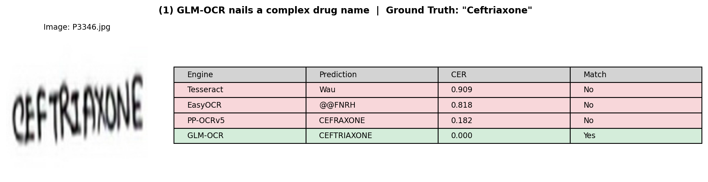
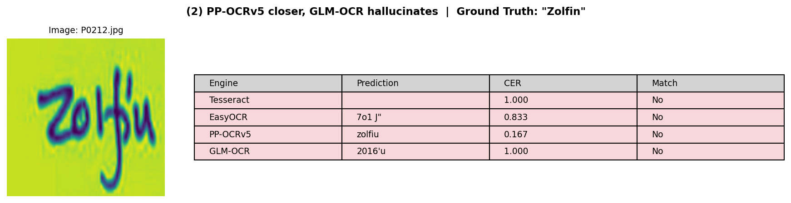
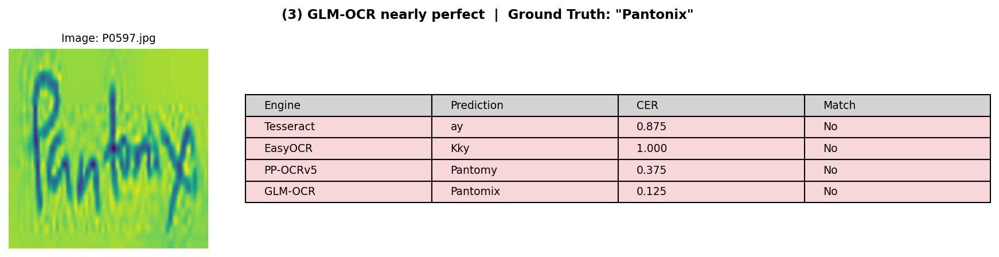
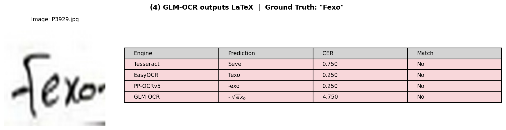

# How Well Can OCR Read Doctor Handwriting in 2026?

*Benchmarking four open-source OCR engines on 5,578 handwritten medical prescriptions*

> **Key Takeaways**
> - PP-OCRv5 (5M parameters) and GLM-OCR (0.9B parameters) both achieve 20%+ exact match on handwritten prescriptions, a 10x jump over Tesseract and EasyOCR
> - GLM-OCR leads on character accuracy (CER 0.328), while PP-OCRv5 leads on word accuracy (WER 0.789)
> - A 5M-parameter model trained on curated data rivals a 900M-parameter vision-language model
> - Neither engine is clinically deployable yet: even the best gets only 1 in 3 words exactly right

---

Last month I spent a full weekend squinting at prescription scans, trying to figure out if a doctor wrote *Amoxicillin* or *Amitriptyline*. I got it wrong twice. That got me wondering: how would today's OCR engines handle this?

The stakes are real. Medication errors injure approximately 1.3 million people annually in the United States alone and cost an estimated $42 billion globally ([WHO](https://www.who.int/news/item/29-03-2017-who-launches-global-effort-to-halve-medication-related-errors-in-5-years), 2017). Illegible handwriting is a well-documented contributor: 35.7% of handwritten prescriptions contain errors, compared to just 2.5% of electronic ones ([Albarrak et al.](https://pmc.ncbi.nlm.nih.gov/articles/PMC4281619/), 2014).

A study of 4,183 prescriptions found that 10.21% of them are illegible, and 19.39% are barely legible ([Albalushi et al.](https://pmc.ncbi.nlm.nih.gov/articles/PMC10686667/), 2023). The global OCR market is projected to reach $32.9 billion by 2030, growing at a 14.8% CAGR ([Grand View Research](https://www.grandviewresearch.com/industry-analysis/optical-character-recognition-market), 2025). Healthcare is one of the fastest-growing verticals driving that growth. But I couldn't find a public benchmark comparing today's open-source OCR engines on handwritten medical text.

So I ran one myself. I tested four engines on **5,578 handwritten prescription word images**, and the results surprised me.

---

## Who Are the Four Contenders?

These four engines span three generations of OCR thinking, from traditional pattern matching to specialized deep learning to generative vision-language models.

### Tesseract: The Veteran

Google-backed and over 18 years old, Tesseract is the default OCR engine for a generation of developers. It uses an LSTM-based architecture designed primarily for printed text. Stable, well-documented, and runs everywhere, but handwritten cursive is not its strength.

### EasyOCR: The Accessible One

Built on a CRNN (Convolutional Recurrent Neural Network) architecture with roughly **10 million parameters**, EasyOCR's selling point is simplicity: `pip install easyocr` and you're recognizing text in 80+ languages. It uses deep learning but remains a traditional detection-recognition pipeline.

### PP-OCRv5: The Data-Centric Specialist

Baidu's latest, with just **5 million parameters**. PP-OCRv5 uses an SVTR_LCNet architecture with a Guided Training of CTC (GTC) strategy. The real innovation isn't the architecture, though. It's the training data.

The PP-OCRv5 paper ([Cui et al.](https://arxiv.org/abs/2603.24373), 2026) shows that *data quality trumps model scale*. They curated **22.6 million training samples** by filtering along three dimensions. First, **difficulty**: they use model confidence as a proxy and found that samples in the [0.95, 0.97] range hit a sweet spot, hard enough to teach the model something new, but not so hard that the labels are unreliable. Second, **accuracy**: they cross-check predictions against labels to weed out mislabeled samples. Third, **diversity**: they cluster training images into 1,000 visual groups using CLIP embeddings and ensure each cluster is represented. Together, these filters yielded 2-3x improvements in handwritten recognition from v3 to v5 without changing the model architecture.

### GLM-OCR: The Compact Vision-Language Model

From Zhipu AI and Tsinghua University, GLM-OCR takes a fundamentally different approach. It's a **0.9-billion-parameter** multimodal model combining a 0.4B CogViT vision encoder with a 0.5B GLM language decoder ([Duan et al.](https://arxiv.org/abs/2603.10910), 2026). Rather than traditional CTC or attention-based sequence recognition, it *generates* text autoregressively, like a language model that reads images.

An important note: 0.9B is **compact** for a vision-language model. For comparison, Qwen3-VL has 235 billion parameters and GPT-4o is even larger. GLM-OCR was designed for efficiency, using Multi-Token Prediction (MTP) to generate approximately 5.2 tokens per decoding step, yielding a roughly 50% throughput improvement over standard autoregressive generation. It's trained through a 4-stage pipeline that includes supervised fine-tuning and GRPO reinforcement learning.

These four engines represent a clear spectrum: **traditional** (Tesseract), **specialized deep learning** (EasyOCR, PP-OCRv5), and **generative VLM** (GLM-OCR). 

---

## What Makes the RxHandBD Dataset So Hard?

We use **RxHandBD** ([Shovon et al.](https://data.mendeley.com/datasets), Mendeley Data), a dataset of 5,578 cropped word images extracted from handwritten medical prescriptions written by doctors in Bangladesh. Each image contains a single word with a corresponding ground-truth label.

This dataset is hard for four reasons:

- **Doctor's handwriting.** Enough said.
- **Medical terminology.** Drug names like "Amoxicillin" and "Metformin" alongside dosage notations like "5% dns" and "1+0+1."
- **Mixed language.** English medical terms interspersed with Bangla script.
- **Inconsistent quality.** Varying paper backgrounds, pen types, and image capture conditions.

Here are a few samples to give you a sense of the difficulty range:

*From top to bottom: a drug name both modern engines nail ("Ronem"), cases where only one engine succeeds ("Vineet" and "Eylox"), and a close call where GLM-OCR gets closest but still misses ("Ambrox").*

One important methodological note: these are **pre-cropped word-level images**. We're isolating the **recognition** half of the OCR pipeline, not testing detection (locating text regions on a full page). This means our results reflect recognition accuracy only. Real-world performance also depends on how well each engine detects text regions before recognizing them.

---

## How Did We Run the Benchmark?

### Metrics

We evaluate using four complementary metrics:

- **CER (Character Error Rate):** Edit distance between predicted and reference strings, normalized by reference length. If the label says "Amoxicillin" (11 characters) and the OCR outputs "Amoxicilin" (1 deletion), the CER is 1/11 = 0.09. Lower is better.
- **WER (Word Error Rate):** Same concept at the word level. Any mistake in a word counts the entire word as wrong. Lower is better.
- **Exact Match Rate:** The strictest metric. Did the OCR output match the ground truth character-for-character after normalization? Higher is better.
- **Latency:** Wall-clock milliseconds per image, measuring practical throughput.

### Setup

All engines run on an Apple Silicon Mac (CPU only). Single run. Default configurations for each engine with no fine-tuning or domain-specific adjustments. PP-OCRv5 runs its full detection + recognition pipeline even on pre-cropped images. GLM-OCR processes each image with the prompt "Text Recognition:".

---

## What Do the Numbers Say?

GLM-OCR achieves the lowest character error rate at 0.328, while PP-OCRv5 leads on word-level accuracy with a WER of 0.789. Both modern engines dramatically outperform the older generation, with exact match rates 8-13x higher than Tesseract or EasyOCR.

| Engine | Type | Parameters | CER (lower=better) | WER (lower=better) | Exact Match (higher=better) | Latency (ms/img) |
|--------|------|------------|---------------------|---------------------|-----------------------------|-------------------|
| Tesseract | LSTM | n/a | 0.785 | 1.043 | 2.5% | 49 |
| EasyOCR | CRNN | ~10M | 0.695 | 1.074 | 2.6% | 14 |
| **PP-OCRv5** | SVTR+CTC | **5M** | 0.477 | **0.789** | 21.4% | 103 |
| **GLM-OCR** | VLM | **0.9B** | **0.328** | 0.801 | **32.6%** | 141 |

Let me walk through what these numbers actually mean.

### Finding 1: Tesseract and EasyOCR Barely Function on Handwriting

Both Tesseract and EasyOCR achieve under **3% exact match**, meaning they get fewer than 1 in 40 words perfectly right. Their WER exceeds 1.0, which means on average they produce *more errors than there are words*. For practical purposes, these engines are unusable on handwritten medical text.

This isn't a knock on either project. Tesseract's LSTM architecture was optimized for printed text, and EasyOCR's CRNN similarly excels on clean, well-formatted inputs. Handwritten medical cursive is simply a different problem.

### Finding 2: The Modern Engines Are a Generational Leap

PP-OCRv5 and GLM-OCR both break the 20% exact match barrier, a qualitative jump from the sub-3% performance of the older engines. The gap between "old" and "new" (a roughly 10x improvement in exact match) is far larger than the gap between PP-OCRv5 and GLM-OCR themselves.

### Finding 3: Why Does GLM-OCR Win on Characters but Lose on Words?

This is the most interesting finding. GLM-OCR achieves a CER of **0.328**, which is 31% lower than PP-OCRv5's 0.477. At the character level, the vision-language approach genuinely helps. GLM-OCR can use its language decoder's knowledge of likely character sequences to infer partially visible characters.

But PP-OCRv5 edges ahead on WER: **0.789 vs 0.801**. It makes fewer word-level mistakes.

Why the divergence? My hypothesis: GLM-OCR's autoregressive generation occasionally produces subtle extra tokens or formatting variations. The GLM-OCR paper itself acknowledges "minor stochastic variation in formatting behaviors, particularly in line breaks and whitespace handling" ([Duan et al.](https://arxiv.org/abs/2603.10910), 2026). These small artifacts barely affect CER but can flip a word from "correct" to "incorrect" in WER/exact-match scoring.

The practical takeaway: **which engine is "better" depends on your error metric.** If you care about getting as close as possible character-by-character (for downstream spell-correction, for example), GLM-OCR wins. If you need clean word-level outputs with minimal postprocessing, PP-OCRv5 has the edge.

### Finding 4: What Are the Real Deployment Trade-offs?

Both engines are fast enough for practical use. PP-OCRv5 processes images at **103ms each** and GLM-OCR at **141ms**. GLM-OCR's Multi-Token Prediction (generating roughly 5.2 tokens per step instead of one) keeps its inference speed competitive despite the larger model.

The bigger difference is **model size and memory footprint**. PP-OCRv5's 5M parameters take up roughly 20MB on disk, small enough for a Raspberry Pi or embedded device. GLM-OCR's 0.9B parameters need around 1.8GB at FP16 (less with quantization). Both run on CPU without a GPU, as our Apple Silicon benchmark shows, but GLM-OCR consumes significantly more RAM. The GLM-OCR paper notes that the model "enables deployment in both large-scale and resource-constrained edge scenarios" and supports frameworks like Ollama for local inference ([Duan et al.](https://arxiv.org/abs/2603.10910), 2026). For deploying across thousands of low-spec workstations, PP-OCRv5's small footprint is a clear advantage. For a centralized server or any machine with a few GB of RAM to spare, GLM-OCR is equally practical.

---

## What Do the Predictions Actually Look Like?

Numbers tell one story. Seeing the actual predictions tells another. Here are four representative samples from the benchmark, hand-picked to illustrate each finding above.

### GLM-OCR Nails a Complex Drug Name

"Ceftriaxone" (a common antibiotic), 11 characters long. Tesseract reads "Wau" and EasyOCR produces "@@FNRH," both useless. PP-OCRv5 gets close with "CEFRAXONE" (CER=0.18, missing the 'ti'). Only GLM-OCR reads it perfectly. On long drug names, the language decoder's knowledge of likely character sequences gives it a real edge.

### When PP-OCRv5 Is Closer and GLM-OCR Hallucinates

"Zolfin" (a proton pump inhibitor). PP-OCRv5 reads "zolfiu" (CER=0.17, just the last character wrong). GLM-OCR outputs "2016'u" (CER=1.0), completely misreading the word as a number. This is the flip side of the VLM approach: when the handwriting doesn't match patterns in the training data, the language model can steer the output in the wrong direction entirely.

### GLM-OCR Nearly Perfect

"Pantonix" (a pantoprazole brand). GLM-OCR outputs "Pantomix" (CER=0.125, one character off). PP-OCRv5 gets "Pantomy" (CER=0.375). Both are close, but GLM-OCR is three times more accurate by CER. Neither gets an exact match, which is the pattern behind Finding 3: GLM-OCR consistently gets closer character-by-character, even when neither engine gets the word exactly right.

### When the VLM Goes Off the Rails

"Fexo" (fexofenadine, an antihistamine). EasyOCR reads "Texo" (CER=0.25) and PP-OCRv5 reads "-exo" (CER=0.25), both reasonable attempts. GLM-OCR outputs LaTeX math notation: `$ \sqrt{e} x_{0} $` (CER=4.75). This is a rare but real failure mode of generative VLMs: the model interprets the handwriting as a math expression instead of text. It produced more characters than the ground truth has, which is why CER exceeds 1.0.

---

## What Are the Limitations?

- **Single dataset, single run.** RxHandBD is one dataset of Bangladeshi prescriptions. US, European, or East Asian handwriting styles may produce different rankings. We don't have confidence intervals from multiple runs.
- **Word-level only.** We tested recognition on pre-cropped word images, not full-page detection + recognition. Real-world performance depends on the complete pipeline.
- **CPU-only.** All engines ran on CPU. GPU acceleration could significantly change the latency picture, particularly for GLM-OCR.
- **Default configs.** No engine was fine-tuned on medical data. Domain-specific adaptation could improve all of them.
- **No clinical validation.** OCR accuracy and clinical safety are different things. A 32.6% exact match rate is impressive for research, but not nearly sufficient for automated prescription processing without human review.

---

## Conclusion

Modern OCR has made a genuine leap on handwritten medical text. **PP-OCRv5** (5M parameters, best word-level accuracy) and **GLM-OCR** (0.9B parameters, best character-level accuracy) both dramatically outperform Tesseract and EasyOCR.

The two champions represent fundamentally different design philosophies: a data-centric specialized pipeline vs. a compact vision-language model. Yet they arrive at remarkably similar performance levels. Both are open-source and practically deployable.

For practitioners building healthcare OCR systems: these two engines deserve serious evaluation. Start with your specific error tolerance, hardware constraints, and whether you need word-level recognition or full-page document understanding.

For researchers: this is a domain with high clinical impact and, as these results show, plenty of room for improvement. Even the best engine here gets only 1 in 3 words exactly right on doctor handwriting. There's real work left to do.

What datasets or engines should I test next? Let me know in the comments.

---

## References

1. World Health Organization. "WHO launches global effort to halve medication-related errors in 5 years." March 29, 2017. https://www.who.int/news/item/29-03-2017-who-launches-global-effort-to-halve-medication-related-errors-in-5-years

2. Albarrak AI, Al Rashidi EA, Fatani RK, Al Ageel SI, Mohammed R. "Assessment of legibility and completeness of handwritten and electronic prescriptions." *Saudi Pharmaceutical Journal*, 2014. https://pmc.ncbi.nlm.nih.gov/articles/PMC4281619/

3. Albalushi AK, et al. "Assessment of Legibility of Handwritten Prescriptions and Adherence to W.H.O. Prescription Writing Guidelines." *J. of Pharmaceutical Research International*, 2023. https://pmc.ncbi.nlm.nih.gov/articles/PMC10686667/

4. Cui C, Zhang Y, Sun T, et al. "PP-OCRv5: A Specialized 5M-Parameter Model Rivaling Billion-Parameter Vision-Language Models on OCR Tasks." arXiv:2603.24373, March 2026. https://arxiv.org/abs/2603.24373

5. Duan S, Xue Y, Wang W, et al. "GLM-OCR Technical Report." arXiv:2603.10910, March 2026. https://arxiv.org/abs/2603.10910

6. Shovon MSH, et al. "RxHandBD: A Handwritten Prescription Recognition Dataset from Bangladesh." *Mendeley Data*. https://data.mendeley.com/datasets

7. Grand View Research. "Optical Character Recognition Market Analysis." 2025. https://www.grandviewresearch.com/industry-analysis/optical-character-recognition-market

---

*Benchmark conducted independently. No affiliation with any OCR project. All engines evaluated using default configurations.*

---

**About the author:** Botao Deng is an ML/AI engineer and researcher who builds and evaluates production models. He independently benchmarks open-source tools and publishes findings to help practitioners make informed technical decisions. [GitHub](https://github.com/robot010)
